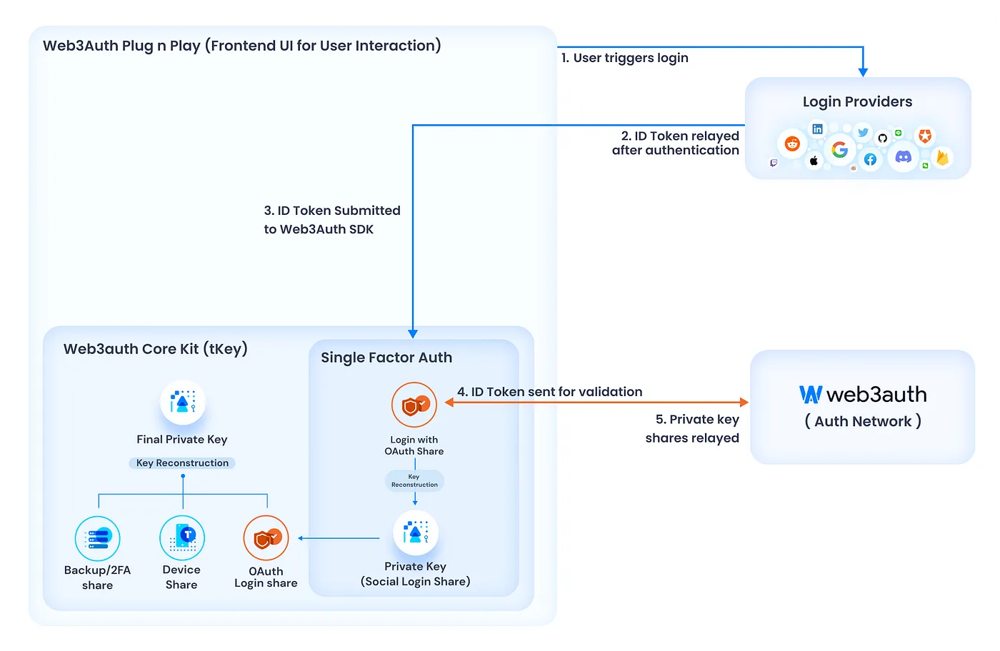

# ZK Controlled 4337 Account

This repository contains contracts and circuits for the ZK (Zero Knowledge) Controlled Account on [Ethereum](https://ethereum.org/en/) using the [ERC-4337](https://eips.ethereum.org/EIPS/eip-4337) standard.

## Overview

In a nutshell, the most popular way to control assets on Ethereum is through a keypair (Private Key and Address). Accounts controlled in this manner are called [Externally Owned Accounts](https://ethereum.org/en/developers/docs/accounts/) (EOAs). This means that the primary way to interact with the Ethereum blockchain is by signing transactions with a private key and distributing them via the network.

The main challenge for non-technical users is the unfamiliarity with such an authorization process. They must learn a lot about security and are constantly warned about losing access to their key, which could result in the loss of all their funds.

One solution is the introduction of the [ERC-4337](https://eips.ethereum.org/EIPS/eip-4337) standard, which defines a common way to establish Account Abstraction.

Account Abstraction is a method for users to interact with the Ethereum blockchain via [Smart Contracts](https://ethereum.org/en/developers/docs/smart-contracts/).

This change allows users to switch to different methods of authorizing and paying for transactions.

This repository presents a new way to authorize User Operations on the Ethereum blockchain using Zero Knowledge Proofs (ZKPs) of a special **identity** key.

## Project Goals

The main idea of the project is to separate the key that controls the user account from the key that is used to sign the transaction.

This tweak would allow us to use Google SSO or other authorization methods to control user accounts. However, this is beyond the scope of the project.

Our main goal is to provide a way for the user to **anonymously** prove the relationship between the controlling and signing keys.

To learn more about existing solutions, read the [Existing solutions](#existing-solutions) section.

## Architecture

This project will be separated into two repositories:

- This repository will contain contracts and circuits.
- [TBD]() - Here you will find a mobile client to use the implemented AA.

### Objectives

The main difference between the authorization idea described and implemented in this repository, compared to the [existing solutions](#existing-solutions), is the use of ZKPs to **anonymously** prove the relationship between the controlling and signing keys, along with native compatibility with keys generated by the [Rarime](https://rarime.com/) project.

We decided to include native compatibility with the [Rarime](https://rarime.com/) project because the idea of controlling an Ethereum account via a [Biometric Passport](https://en.wikipedia.org/wiki/Biometric_passport) is exciting.

In this project, we will use:
1. A keypair on the [BabyJubJub curve](https://eips.ethereum.org/EIPS/eip-2494) as the controlling source and regular Ethereum keys as session keys.
2. ZKPs to prove the connection between the main keypair and session keys.

### Implementation (TBD)

##  Existing solutions

### [Particle Auth](https://developers.particle.network/api-reference/auth/introduction)

It is a self-custodial auth infra for Web3 apps and wallets powered by SDKs for different platforms. 
Particle Auth enables users to log in through Google, Apple ID, Facebook, Twitter and other social methods, and can also log in with Email / Mobile number without a password

Source: [Account Abstraction Landscape by Distributed Lab](https://distributed-lab.medium.com/account-abstraction-landscape-a8ccfe7a022a)

### [Web3Auth](https://web3auth.io/)

Web3Auth is not just a signer provider but a perfect example of utilizing MPC technology in AA wallets.

The Web3Auth SDK lives solely on the user/application’s front-end client and handles the interactions between OAuth providers and the Auth Network. 
From the diagram below you can see how different Web3Auth products are related to other applications.

**Plug and Play SDK** is like a wrapper for all other internal processes. 
It includes UI components like modal and facilitates the embedding of the login function. 
From the modal user is redirected to the login/OAuth provider, and after carrying out the authentication process there, is redirected back. 
After the successful authentication, Web3Auth handles the reconstruction of the user’s key.

**Core Kit SDK** is the backbone of the magic happening behind simple login. It can be divided into 2 types:

- Single Factor Auth. It is semi-custodial in nature, since the key is custodial to the Auth Provider and the Web3Auth Network, 
but neither Web3Auth, Social Login Providers, nor any other party holding a key share can claim full ownership. 
This can be achieved because to create a social login share, users interact with the Web3Auth Auth Network, 
where key generation operates via a 5/9 consensus system.

- Multi-Factor Auth. Here things become more interesting because this is where MPC comes to the game. 
With the Web3Auth infrastructure, your key is divided into multiple parts and stored across your devices and the Auth Network. 
In the traditional Web3Auth SDK, your key was dynamically reconstructed in the front end using threshold signatures. 
In the MF Auth case, it is never reconstructed, your key remains divided. Each part of your key on its own can sign a piece of a message or transaction. 
These partial signatures are collected and combined using a method called Threshold Signature Scheme (TSS) to create a complete signature. 
This final signature can then be used to execute transactions on the blockchain.

**Auth Network** is an open-source wallet management network that safely splits and secures user wallets. Current operators are Binance, Ethereum Name Service, Etherscan, Polygon (MATIC), Zilliqa, Tendermint, Ontology, SKALE, and Web3Auth (Torus).

To make things simpler we can think of the Web3Auth key management infrastructure in the following way:

1. user’s private key is split into multiple shares using SSS(Shamir Secret Sharing): socials (Google, Twitter, etc), device, and backup/security question.
2. OAuth (social login) share is split into 9 shares, and they are held by 9 different nodes inside the Auth Network.
3. when the user is trying to log in 5 out of those 9 shares are fetched and combined with any other share. This way the key is reconstructed (2/3).

Source: [Account Abstraction Landscape by Distributed Lab](https://distributed-lab.medium.com/account-abstraction-landscape-a8ccfe7a022a)

### [Privy](https://www.privy.io/)

Privy is a library that provides authentication flows and embedded wallets to your app. 
The most mature product is Privy React SDK which with the help of simple broadly customizable 
React components and hooks makes it easy for users to onboard. 
It supports multiple methods for authenticating:

- email or phone number via a one-time password (OTP)
- social accounts (Google, Apple, Twitter, Discord, Github, TikTok, LinkedIn, Spotify) via the OAuth2.0 Protocol
- verifying the user’s ownership of a wallet via the Sign In With Ethereum (SIWE) standard.

An important thing here is that one user can associate multiple login methods to his account.

The key feature is Embedded wallets. Privy allows users to connect an external Ethereum wallet to your app, or to create a secure, self-custodial embedded wallet associated with the login method. Both of them are able to do basic wallet tasks but embedded wallets do not require a separate wallet client, like a browser extension or a mobile app, and can be accessed directly from your product (that is why they are embedded). Another difference is some extra customization in terms of how signature and transaction prompts are presented to users.

Source: [Account Abstraction Landscape by Distributed Lab](https://distributed-lab.medium.com/account-abstraction-landscape-a8ccfe7a022a)

### Others 

It is not a complete list of possible solutions. To learn more about ways to implement Account Abstraction, particularly the different methods of authorization that exist in WEB3, read an excellent Medium article on this topic: [Account Abstraction Landscape by Distributed Lab](https://distributed-lab.medium.com/account-abstraction-landscape-a8ccfe7a022a).

## Library 

- [circom -- Circuit Compiler](https://docs.circom.io/)
- [ERC-4337: Account Abstraction Using Alt Mempool](https://eips.ethereum.org/EIPS/eip-4337)
- [Account Abstraction Landscape by Distributed Lab](https://distributed-lab.medium.com/account-abstraction-landscape-a8ccfe7a022a)
- [100+ Smart Account Modules](https://wallet-ecosystem.notion.site/100-Smart-Account-Modules-8873025da42c49648bfe03bf980c89d6)

# Deployments 

| Contract Name               | Network | Address                                      |
|-----------------------------|---------|----------------------------------------------|
| Some Token                  | Sepolia | 0xB7e34aEB1ba4E2C270d27e980Ba47BaABb34DD09   |
| EntryPoint v0.7.0           | Sepolia | 0xC1ECEd7578cDcED435717BDF3a667D3cf418bE0C   |
| Smart Account Factory       | Sepolia | 0x9aEA6E9504cCA01B267dAc45e0cC2883F8c0ae31   |

# Showcases

| Action                       | Network | Transaction                                                                                                                             |
|------------------------------|---------|-----------------------------------------------------------------------------------------------------------------------------------------|
| Deploy Account + Mint tokens | Sepolia | [Handle Ops of Deployment and Mint](https://sepolia.etherscan.io/tx/0x0931a898e8184d731f26ad03ae78ba9d55d10647e0aaee912b303632f716c668) |

